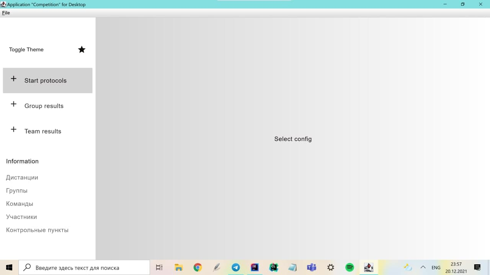
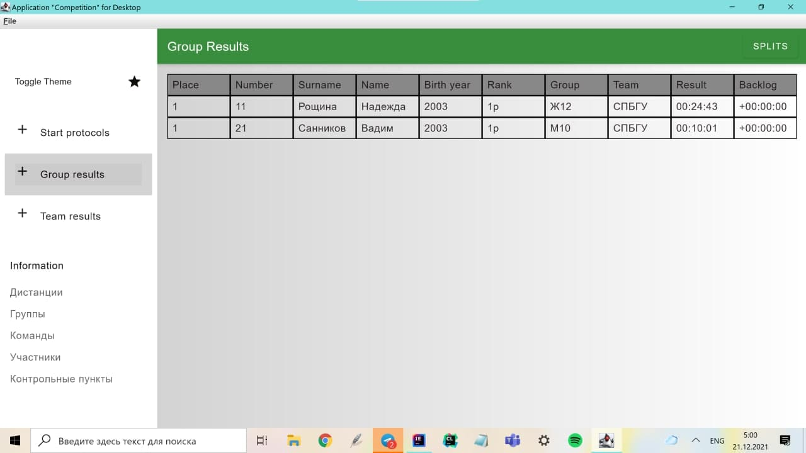
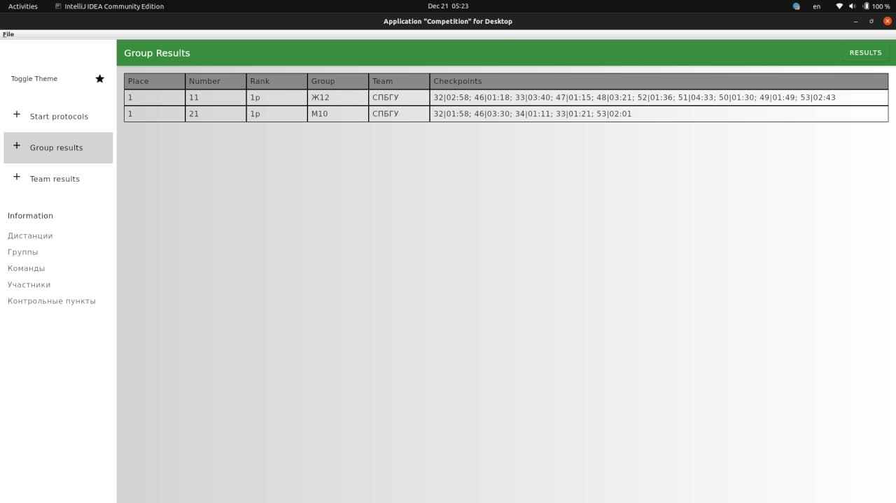
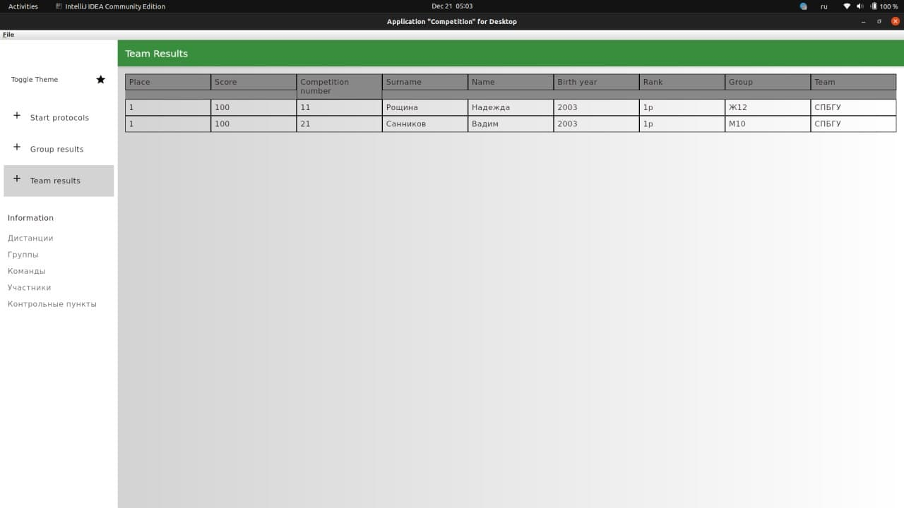
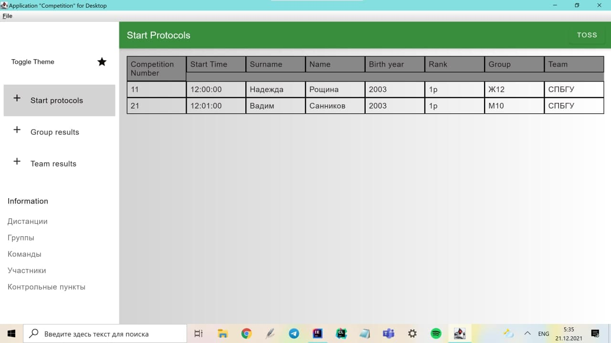
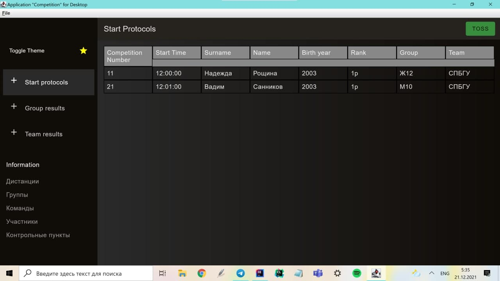

# Графическое приложение для проведения спортивных соревнований

## Предыдущая версия проекта
В предыдущей версии проекта реализовывалось консольное приложение,
имеющее базовые возможности текущего. Новым пользователям
рекомендуется сначала ознакомиться с [описанием](OLD_DOCS.md)
предыдущей версии.

## Обзор приложения

Данный проект реализует графическое приложение для помощи при проведении
спортивных соревнований по циклическим видам спорта.

Система поддерживает возможность проведения нескольких соревнований одновременно.
Все данные, загруженные пользователям, сохраняются в базе данных, и сохраняются
между запусками программы.

В процессе использования программы можно как загружать данные из файлов, так
и корректировать их вручную. При любых изменениях во входных данных программа
автоматически пересчитает результаты групп, сплиты и результаты по командам.

## Начало работы

При запуске программы требуется загрузить конфигурационный файл,
содержащий данные о соревновании.



Формат файла несколько отличается от предыдущей версии. В соответствии с примером
перечисляются название события, дата и время проведения соревнований, вид спорта;
разряды спортсменов, группы участников и соответствующие им дистанции; 
список всех чекпоинтов и критерии каждой дистанции.

```yaml
eventName:
  sampleEvent

eventDate:
  20.02.2022

eventTime:
  12:00:00

eventSport:
  orienteering


ranks:
  - 3ю
  - 2ю
  - 1ю
  - 3р
  - 2р
  - 1р
  - КМС
  - МС


groups:
  - group: М10
    distance: МЖ9 10
  - group: М12
    distance: М12
  - group: М14
    distance: М14
  - group: М16
    distance: М16 Ж60
  - group: М18
    distance: М18 21 40 50
  - group: М21
    distance: М18 21 40 50
  - group: М40
    distance: М18 21 40 50
  - group: М60
    distance: Ж21 40 М60
  - group: Ж10
    distance: МЖ9 10
  - group: Ж12
    distance: Ж12
  - group: Ж14
    distance: Ж14
  - group: Ж16
    distance: Ж16 студенты
  - group: Ж18
    distance: Ж21 40 М60
  - group: Ж21
    distance: Ж21 40 М60
  - group: Ж40
    distance: Ж21 40 М60
  - group: Ж60
    distance: М16 Ж60
  - group: Мстуд
    distance: Ж16 студенты
  - group: Жстуд
    distance: Ж16 студенты
  - group: VIP
    distance: МЖ9 10


checkpoints:
  - 31
  - 32
  - 33
  - 34
  - 45
  - 46
  - 47
  - 48
  - 49
  - 50
  - 51
  - 52
  - 53
  - 100
  - 101
  - 102
  - 104

criteria:

  - distance: М18 21 40 50
    type: choice
    count: 3
    checkpoints:

  - distance: МЖ9 10
    type: fixed
    count: 5
    checkpoints:
    - 32
    - 46
    - 34
    - 33
    - 53

  - distance: Ж14
    type: fixed
    count: 3
    checkpoints:
    - 47
    - 46
    - 45

  - distance: Ж12
    type: fixed
    count: 10
    checkpoints:
    - 32
    - 46
    - 33
    - 47
    - 48
    - 52
    - 51
    - 50
    - 49
    - 53

  - distance: М12
    type: fixed
    count: 3
    checkpoints:
    - 32
    - 46
    - 34

  - distance: М14
    type: fixed
    count: 4
    checkpoints:
    - 31
    - 32
    - 33
    - 34

  - distance: Ж21 40 М60
    type: fixed
    count: 4
    checkpoints:
    - 33
    - 34
    - 33
    - 34

  - distance: М16 Ж60
    type: choice
    count: 4
    checkpoints:


  - distance: Ж16 студенты
    type: choice
    count: 2
    checkpoints:
    - 100
    - 101
    - 102
    - 104
```
 


## Группы и дистанции

После загрузки данные групп и дистанций доступны в соответствующих вкладках
под заголовком `Informaton`, и можно вручную изменить или добавить дистанцию
или группу. Невалидные данные не будут считаны.

По сравнению с предыдущей версией теперь поддерживаются разные типы дистанций.
В стандартной дистанции с заданным направлением (ключевое слово для типа - `FIXED`) участник должен отметиться
на нескольких контрольных пунктах в строго заданном порядке. Чекпоинты могут
повторяться, а могут быть различными.
Второй поддерживаемый тип дистанции - дистанция по выбору (ключевое слово для типа - `CHOICE`).
Участник должен взять фиксированное количество пунктов из заданного списка, или из всех
чекпоинтов, установленных на местности, если список не указан. При этом отметки на чекпоинтах не из указанного списка,
а также повторные отметки на одном и том же чекпоинте не считаются.

Реализация критерия дистанции по сравнению с предыдущей версией проекта вынесена в отдельный
интерфейс `DistanceCriteria`, поэтому теперь поддержка новых типов дистанций стала гораздо
проще для реализации.


## Работа с программой

На вкладках `Команды`, `Участники` и `Контрольные пункты` можно вручную загрузить данные
о спортсменах и о прохождении дистанции. Для примера в базе данных
[соревнования](src/test/resources/config.yaml)
уже лежат засечки на контрольных пунктах для двух участников и их результаты.

При обновлении входных данных стартовые протоколы, результаты групп, сплиты и командные результаты
пересчитаются автоматически. Для просмотра нужно лишь перейти на вкладку `Start Protocols`,
`Group Results` или `Team Results` соответственно.

Во вкладке `Group Results` есть кнопка для переключения режима просмотра между обычными результатами
и сплитами участников.

Пример работы программы:




## Почему именно наш проект?
✨🌟💖💎🦄💎💖🌟✨🌟💖💎🦄💎💖🌟✨

В последнее время рынок приложений для проведения спортивных 
соревнований стал невероятно конкурентным. Однако ни в каком другом
приложении вы не найдете уникальной возможности переключения
между темной и светлой темой с идеально подобранными
цветами, приятными человеческому глазу,
что невероятно важно для оптимизации
работы как в дневное, так и в ночное время суток.

Чтобы переключить тему, достаточно одного нажатия на кнопку
`Toggle Theme`




